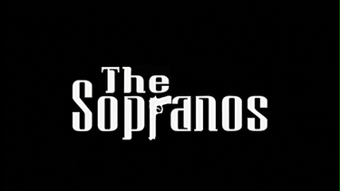
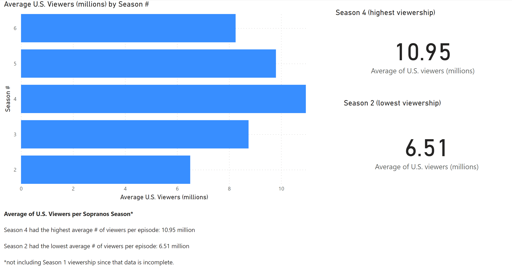

# The Sopranos
## Main
**The Sopranos** is an [American crime drama television series](https://en.wikipedia.org/wiki/The_Sopranos) created by David Chase. The series follows Tony Soprano (James Gandolfini), a New Jersey *Mafia* boss who suffers from panic attacks. He reluctantly begins seeing a psychiatrist, Dr. Melfi (Lorraine Bracco), who encourages him to open up about his difficulties balancing his family life with his criminal life. Other important characters include Tony's family, *Mafia* colleagues, and rivals, most notably his wife Carmela (Edie Falco) and his protégé and distant cousin Christopher Moltisanti (Michael Imperioli).

## Views

| Season | Average views |
| --- | --- |
| Season 2 | 6.51 million (lowest avg) |
| Season 3 | 8.75 million |
| Season 4 | 10.95 million (highest avg) |
| Season 5 | 9.8 million |
| Season 6 | 8.25 million |
## Reason for season 4 highest views
I think Season Four was the culmination of everything Chase wanted to do with the show. It was the perfect balance of family life and mafia life while feeling a lot more mature than the first 3 seasons. I think they really hit the "style" they wanted. 